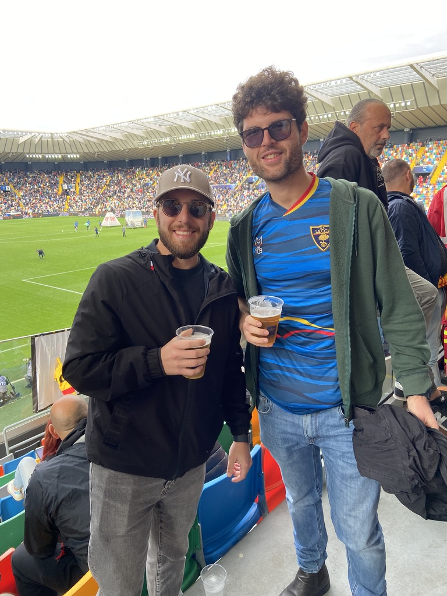
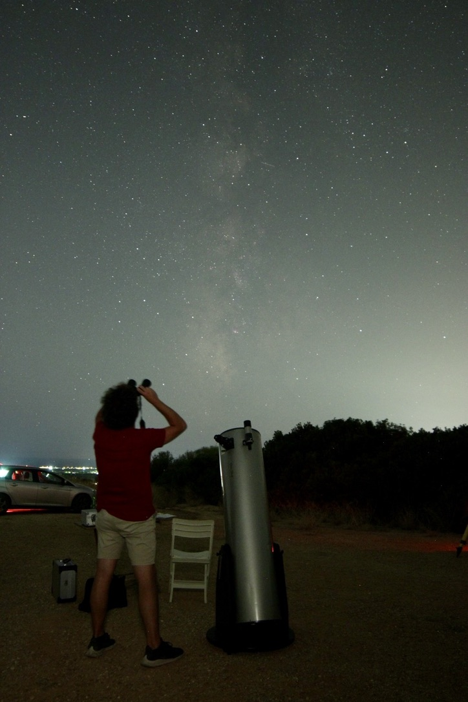
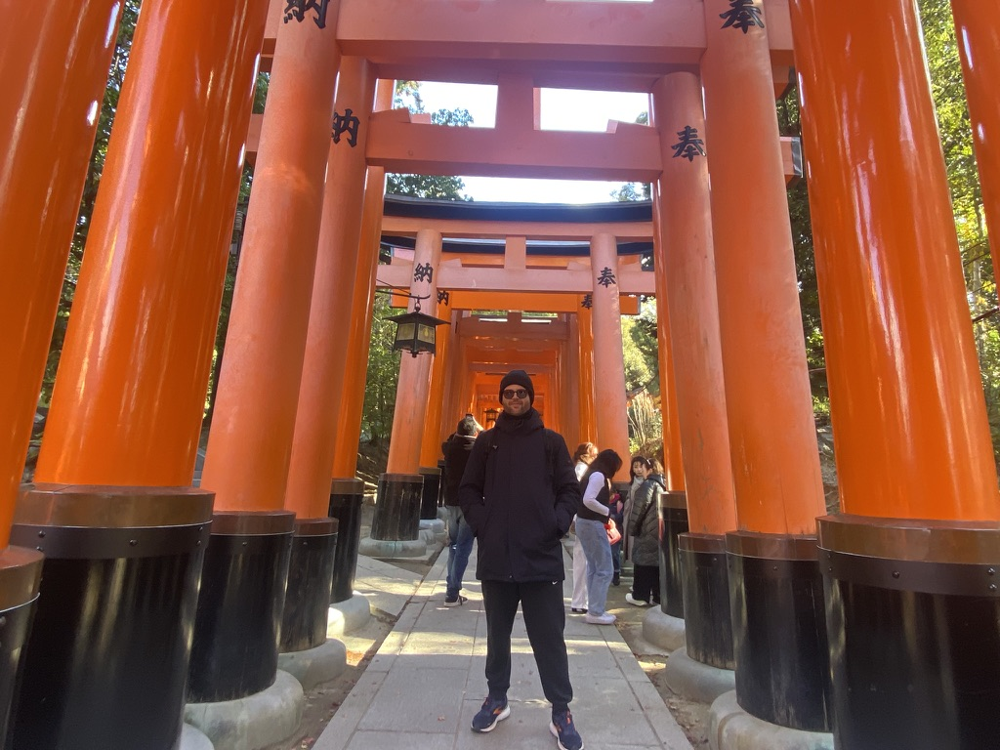
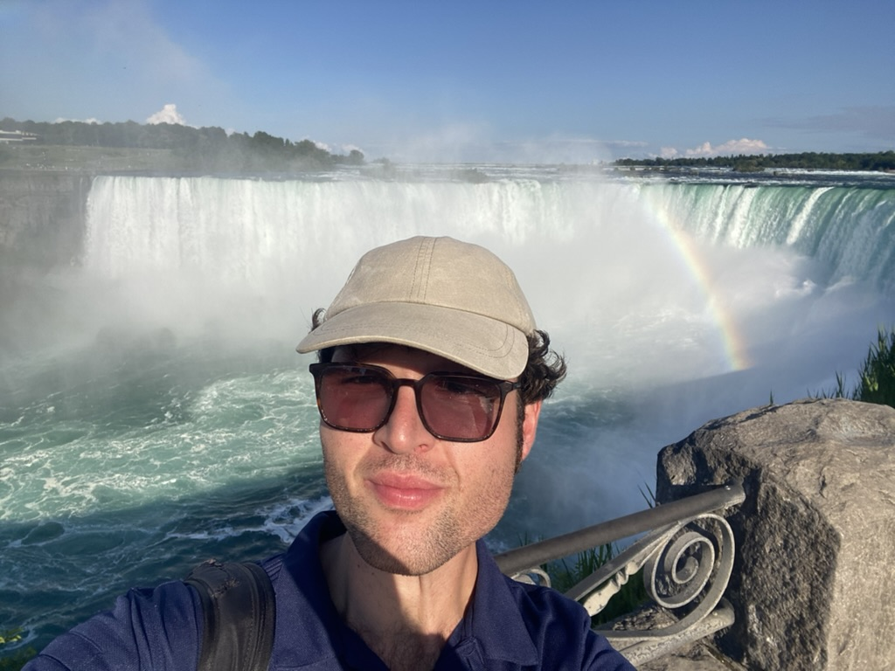
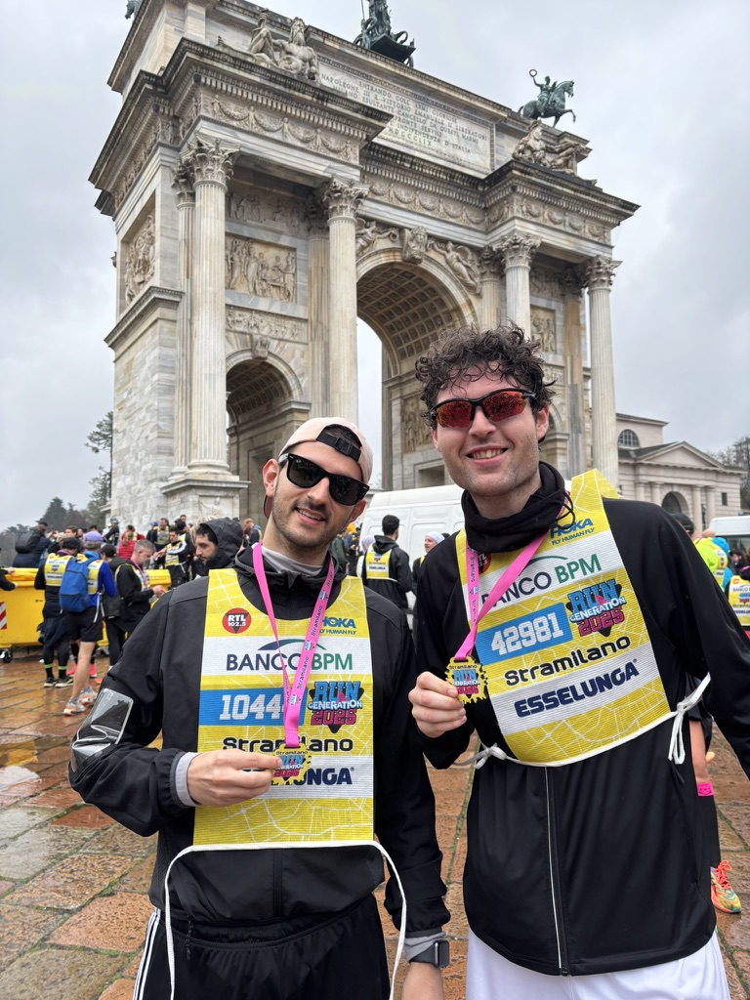
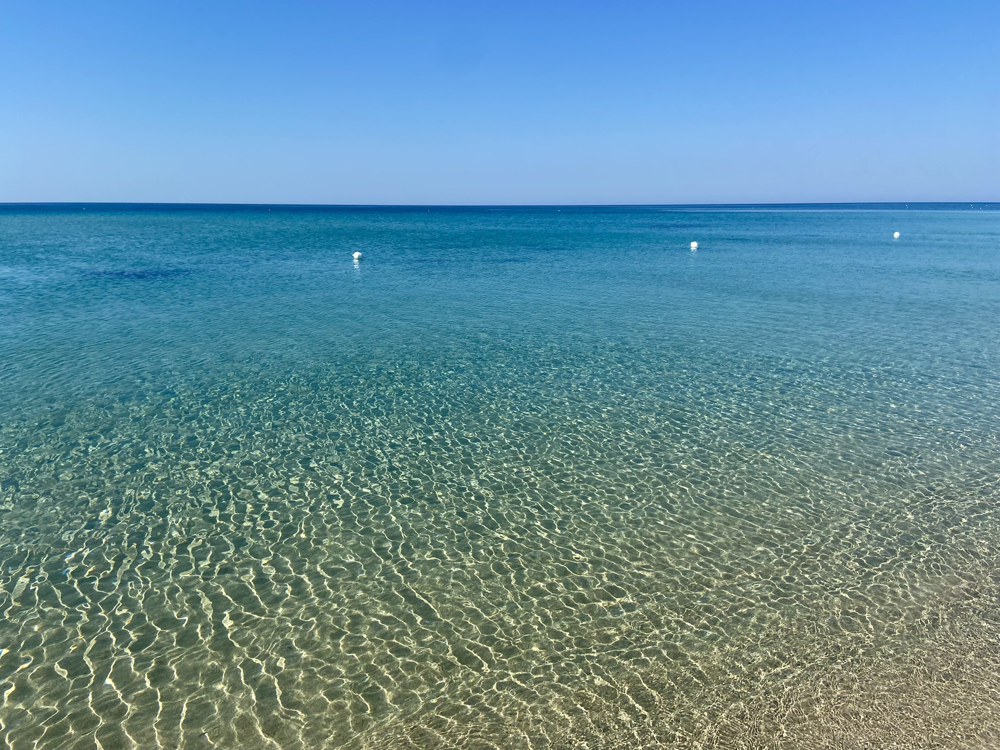

I grew up in **Copertino**, a small town in the Salento peninsula — the heel of Italy's boot — a place of beautiful sea and authentic traditions. The name might recall "Cupertino" in Silicon Valley, which was actually named after an arroyo that was itself named after **[Saint Joseph of Cupertino](https://en.wikipedia.org/wiki/Joseph_of_Cupertino)** — born in my town in 1603, and patron saint of aviators, astronauts, and students. Probably just a coincidence, but I have always enjoyed being a student.

In particular, I have always been fascinated by stars and astronomy. When I was 15, I started observing the sky with a 10-inch Dobson telescope, which got me into amateur astronomy and science outreach — something I still do, though unfortunately less and less often. My telescope, unlike me, stayed in Salento.

Among other things, I enjoy the sea, playing and singing (with very poor results), travelling, and running. I enjoy playing and watching soccer, and in particular the games of **US Lecce**, the Serie A club from my region, which I never miss watching live when I get the chance.

  
  
  
  
  
  

